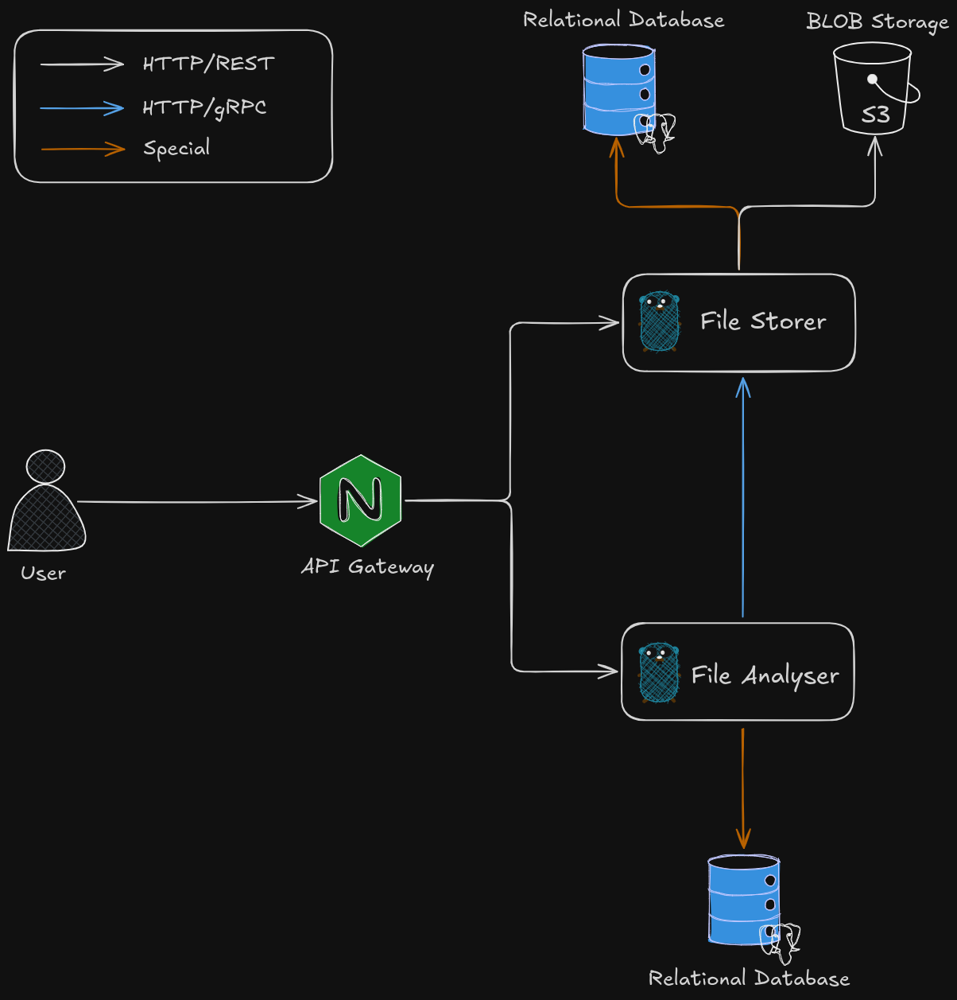
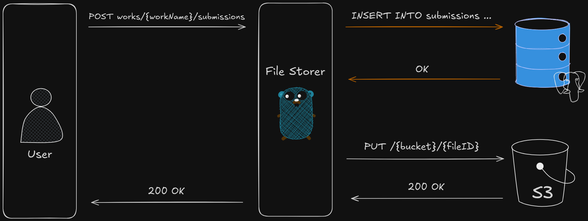
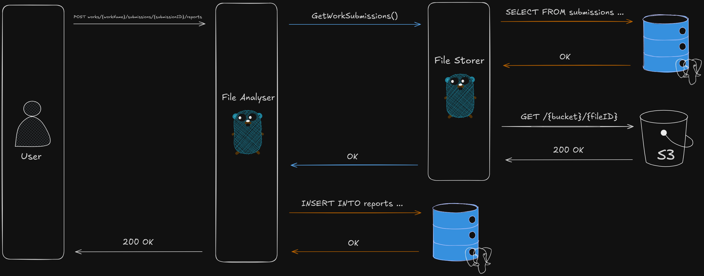
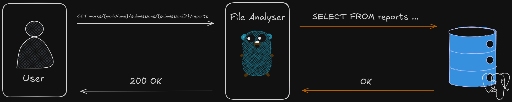

# КПО ДЗ 3
Лещук Глеб, 249

## Краткое описание
Система анализа плагиата реализована как два микросервиса на языке Go. Имеется возможность загружать студенческие работы, создавать отчеты по наличию плагиата, просматривать отчеты.

## Архитектура системы


- File Storer - Сервис хранения файлов. Имеет единственную HTTP ручку для загрузки файла, принимает файл и его метаданные (имя студента) в формате multipart/form-data. Сохраняет в S3-совместимое хранилище minio.
- File Analyzer - Сервис создания и хранения отчетов о плагиате. Общается с File Storer с помощью gRPC, принимает и анализирует файлы. Сохраняет и отдает готовые отчеты по отправкам работ.
- nginx - Проксирует запросы и с помощью pattern mathcing'a url перенаправляет их в один из микросервисов.

## Пользовательские сценарии
Создание отправки по работе:

File Storer создает запись "Отправка работы" в базе данных и сохраняет файл в хранилище. 

Генерация отчета по работе:

File Analyzer запрашивает у File Storer файлы всех посылок по текущей работе, находит ту посылку, по которой нужно составить отчет, сравнивает со всеми посылками, которые были созданы другими студентами до целевой, считает процент схожести с каждой посылкой (те посылки, для которых процент выше 80, добавляются в отчет), вычисляет средний процент оригинальности. Процент схожести вычисляется с помощью [коэффициента Жакарра](https://en.wikipedia.org/wiki/Jaccard_index). Отчет сохраняется в БД.

Промотр отчетов по работе:

У File Analyzer запрашиваются все отчеты по данной работе. 

## Сборка, запуск, тестирование, аудит
Предусловие: На вашей машине должен быть установлен [Docker](http://docs.docker.com/engine/install/) и [docker compose](https://docs.docker.com/compose/install/)

Собрать образы и запустить приложение:
```
make build && make
```

Сгенерировать весь кодген (может понадоиться для аудита кода):
```
make generate
```

Удалить все сгенерированные файлы:
```
make clean
```

Почистить вольюмы баз данных и хранилища:
```
make drop
```

Во время тестирования можно пользоваться:
- [Swagger Editor](https://editor.swagger.io/) - можно отправлять запросы в микросервисы прямо из браузера. API спеку брать по путям `./{service}/api/http/api.yml`,
- [Minio UI](http://localhost:9001) - можно смотреть сохраненные файлы в minio
- [PGAdmin](http://localhost:8080) - можно смотреть базы данных
